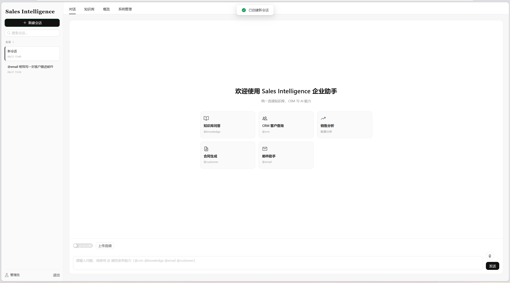
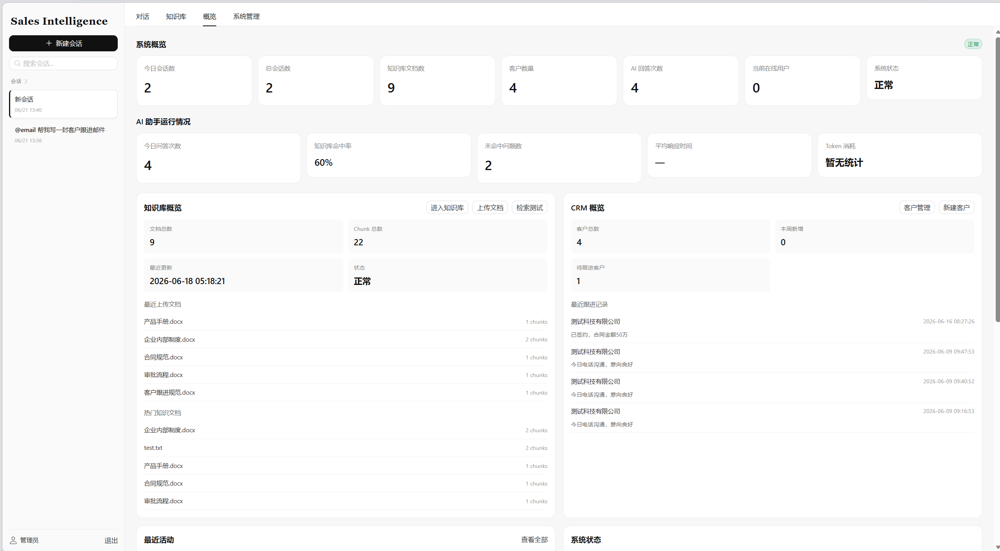
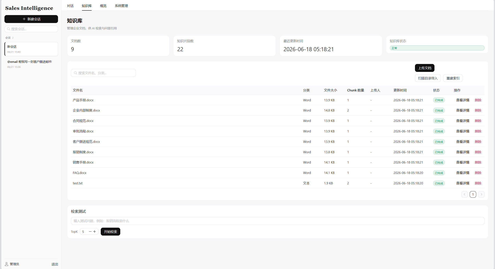
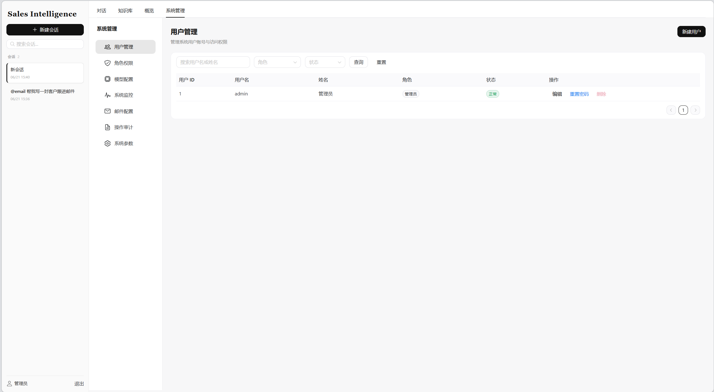
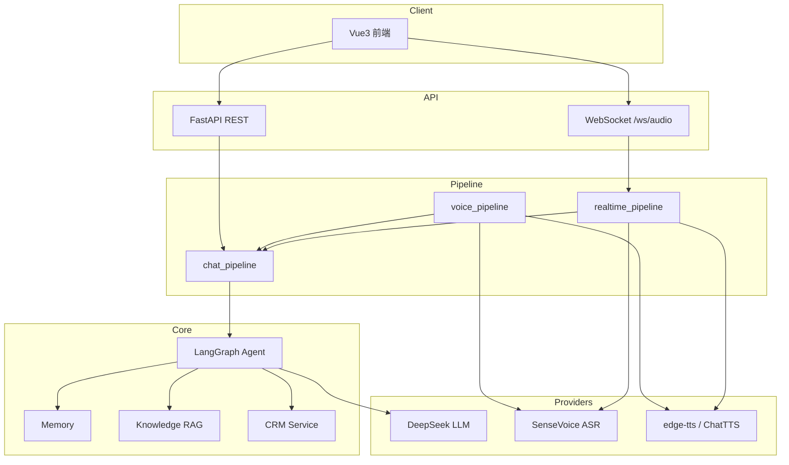

# Voice-CRM

智能语音 CRM：FastAPI + Vue3，支持文本/语音对话、WebSocket 实时语音、RAG 知识库、CRM 与 LangGraph Agent。

## 功能特性

- JWT 登录与 RBAC 角色权限
- 多会话文本对话，可选语音回复
- 音频上传与 **WebSocket 实时语音**（VAD → ASR → Agent → TTS）
- RAG 知识库（ChromaDB + BGE + BM25 混合检索）
- CRM 客户查询与 Agent 写操作确认流
- 概览 Dashboard、审计日志、管理后台

## 界面预览

| 对话 | 概览 Dashboard |
|:---:|:---:|
|  |  |

| 知识库 | 系统管理 |
|:---:|:---:|
|  |  |

## 系统架构



详细约定见 [docs/architecture.md](docs/architecture.md)。

## 技术栈

| 层级 | 技术 |
|------|------|
| 后端 | FastAPI、SQLAlchemy、Alembic、LangGraph |
| 前端 | Vue 3、TypeScript、Vite、Naive UI |
| 语音 | FunASR (SenseVoice)、Silero VAD、edge-tts / ChatTTS |
| 知识库 | ChromaDB、BGE Embedding、BM25 |
| LLM | DeepSeek API（可扩展 Provider） |

## 环境要求

- **Python** 3.11+
- **Node.js** 18+（`run.py` 会自动拉起前端；仅需后端时可省略）
- **磁盘** 建议 8GB+（模型首次下载占用较大，**勿提交 Git**）
- **网络** LLM、edge-tts、HuggingFace / ModelScope 下载需可访问外网

## 快速开始

### 1. 获取代码与依赖

```bash
git clone https://github.com/<your-username>/Voice_CRM.git
cd Voice_CRM

python -m venv .venv
# Windows
.venv\Scripts\activate
# Linux / macOS
# source .venv/bin/activate

pip install torch torchaudio --index-url https://download.pytorch.org/whl/cpu  # 可选，加速安装
pip install -r requirements.txt
cd web_server && npm install && cd ..
```

### 2. 配置

```bash
copy config.example.yaml config.yaml   # Windows
copy .env.example .env
# Linux / macOS: cp config.example.yaml config.yaml && cp .env.example .env
```

编辑 `.env`，至少设置：

```env
LLM_API_KEY=sk-your-deepseek-api-key
```

密钥只放 `.env`，不要写入 `config.yaml`。生产环境另设 `JWT_SECRET_KEY`（≥ 32 位随机字符串）。

### 3. 启动

```bash
python run.py
```

| 入口 | 地址 |
|------|------|
| 前端 | http://localhost:5173 |
| 后端 API | http://127.0.0.1:8000 |
| Swagger | http://127.0.0.1:8000/docs |
| 默认账号 | `admin` / `admin123`（首次启动自动创建） |

```bash
python run.py --no-frontend           # 仅后端
python run.py --no-frontend --reload  # 后端热重载
```

> 若浏览器直接进入主界面、未显示登录页，多为本地仍保存 JWT（`localStorage`）。侧边栏「退出」或清除站点数据即可。

### 4. 知识库（可选）

将文档放入 `main_server/data/knowledge/`，然后：

```bash
python scripts/ingest_knowledge.py
```

### 5. 语音模型（按需）

```bash
python -m main_server.utils.download_asr_model
python -m main_server.utils.download_vad_model
```

## Docker 部署

```bash
copy .env.example .env   # 填写 LLM_API_KEY、JWT_SECRET_KEY
docker compose up -d --build
```

| 服务 | 地址 |
|------|------|
| 前端 | http://localhost:8080 |
| API 文档 | http://localhost:8000/docs |

```bash
docker compose exec api python scripts/ingest_knowledge.py
```

- 全栈部署：`docker-compose.yml`
- 仅 PostgreSQL 容器（本地开发）：`docker-compose.postgres.yml`

详见 [docs/deployment.md](docs/deployment.md)。

## 目录结构

```
Voice_CRM/
├── agent/              # LangGraph Agent 与工具
├── alembic/            # 数据库迁移
├── deploy/             # Dockerfile、Nginx
├── docs/               # 项目文档
├── main_server/        # FastAPI 后端
├── scripts/            # 运维脚本
├── tests/              # pytest + live 验收
├── web_server/         # Vue3 前端
├── config.example.yaml
├── docker-compose.yml
└── run.py
```

## 环境变量

| 变量 | 必填 | 说明 |
|------|:----:|------|
| `LLM_API_KEY` | 是 | DeepSeek API Key |
| `JWT_SECRET_KEY` | 生产 | JWT 签名密钥 |
| `DATABASE_URL` | 否 | 留空则使用 SQLite |
| `CORS_ORIGINS` | 否 | 逗号分隔的前端域名 |
| `SMTP_PASSWORD` | 否 | 邮件 SMTP 密码 |
| `HF_TOKEN` | 否 | HuggingFace 下载加速 |

完整列表见 [.env.example](.env.example)。

## 文档

| 文档 | 说明 |
|------|------|
| [docs/README.md](docs/README.md) | 文档索引 |
| [docs/architecture.md](docs/architecture.md) | 架构与 Pipeline |
| [docs/api.md](docs/api.md) | API 概览 |
| [docs/database.md](docs/database.md) | 数据库 |
| [docs/deployment.md](docs/deployment.md) | 部署 |
| [docs/faq.md](docs/faq.md) | 常见问题 |
| [tests/README.md](tests/README.md) | 测试 |
| [CONTRIBUTING.md](CONTRIBUTING.md) | 贡献 |
| [SECURITY.md](SECURITY.md) | 安全 |
| [CHANGELOG.md](CHANGELOG.md) | 版本记录 |

## 测试

```bash
pytest tests/unit tests/api tests/integration
```

## 常见问题

| 问题 | 处理 |
|------|------|
| 无法对话 | 检查 `.env` 中 `LLM_API_KEY`，访问 `/health` |
| 无登录页 | 清除浏览器 `localStorage` 或点击「退出」 |
| 知识库无结果 | `python scripts/ingest_knowledge.py` |
| 语音识别失败 | 运行 `download_asr_model` |
| 端口占用 | 修改 `config.yaml` 的 `app.port` |

更多见 [docs/faq.md](docs/faq.md)。

## License

[MIT](LICENSE)
