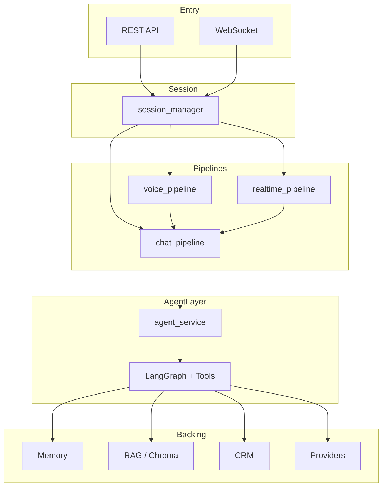

# Voice-CRM 架构约定

## 系统总览



## 对话编排层级

```
API / WebSocket
    ↓
Session（session_manager）
    ↓
Pipeline
    ├─ chat_pipeline      ← 文本对话唯一入口
    ├─ voice_pipeline     ← 上传音频：ASR → chat → TTS
    └─ realtime_pipeline  ← WebSocket：VAD → ASR → chat → TTS
            ↓
    agent_service（内部模块）
            ↓
    LangGraph Agent（Function Calling，agent ⇄ tools）
            ↓
    Memory / RAG / CRM / Providers
```

## 硬性约定

| 规则 | 说明 |
|------|------|
| 外部只调 `chat_pipeline` | `voice_pipeline`、`realtime_pipeline` 不得直接 `agent_service.invoke()` |
| `agent_service` 为内部模块 | 仅 `chat_pipeline._invoke_agent()` 调用 |
| LLM 调用 | 经 `llm_service`；Agent 节点不直连 Provider |
| TTS | 在 `chat_pipeline` 内可选完成，不在 API 层拼装 |
| 业务逻辑 | 在 `main_server/services/`；`agent/tools/` 仅薄封装 |

## Pipeline 职责

| Pipeline | 场景 |
|----------|------|
| `chat_pipeline` | 单轮文本对话（Agent + 可选 TTS） |
| `voice_pipeline` | HTTP 上传音频 |
| `realtime_pipeline` | WebSocket 实时语音 |

## Agent 模式

主 Graph 使用 **Function Calling 多步 Agent**（`agent ⇄ tools`）。旧 intent 路由节点（`crm_node` / `knowledge_node` / `chitchat_node`）已移除。

## 相关文档

- [api.md](api.md) — HTTP / WebSocket 接口
- [database.md](database.md) — 持久化与迁移
- [deployment.md](deployment.md) — 部署方式
